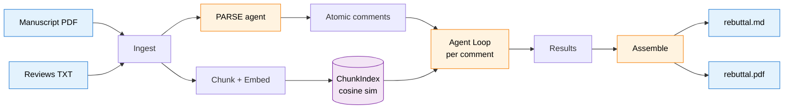
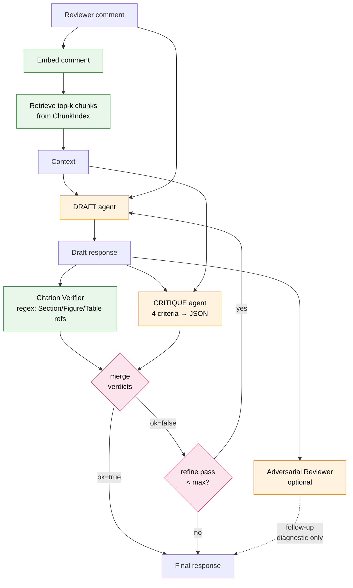
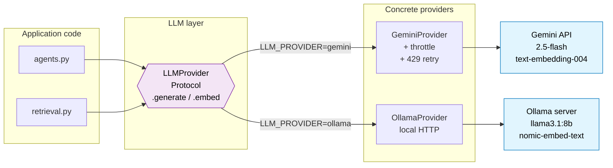
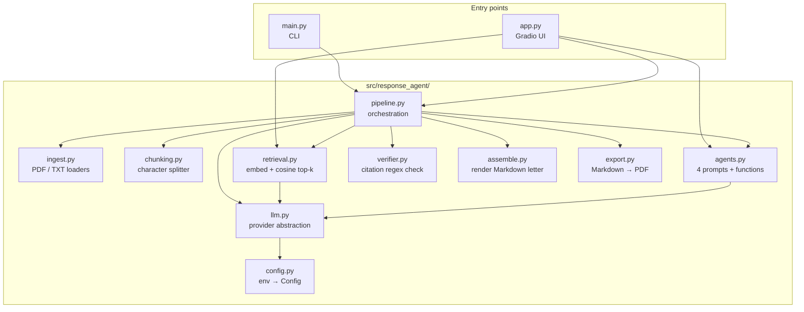
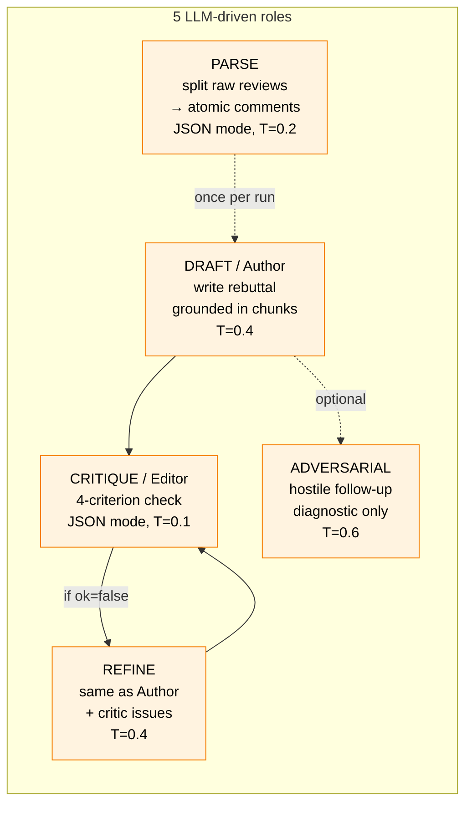

# Architecture Diagrams

Five Mermaid diagrams covering different views of the system. Paste any of
these into the [Mermaid Live Editor](https://mermaid.live) to render and
export as PNG/SVG for the Kaggle gallery.

---

## 1. High-level pipeline

End-to-end view: inputs in, rebuttal out. This is the "elevator" diagram.

---

## 2. Agent loop (the heart of the system)

What happens for *each* parsed reviewer comment. This is where the "agent"
label is earned — Draft → Critique → Verify → Refine is a real feedback loop,
not a single prompt.

---

## 3. LLM provider abstraction

How the pipeline stays provider-agnostic. Swap `LLM_PROVIDER=gemini` for
`LLM_PROVIDER=ollama` in `.env`; no code changes.

---

## 4. Module layout

What lives where in the codebase. Every module has one job.

---

## 5. The 5 LLM roles

The agent is not one prompt — it's five roles, each with a distinct system
prompt and a distinct job.

---

## Rendering tips

- All five render cleanly in [mermaid.live](https://mermaid.live).
- For the gallery, "Diagram 1" (high-level) + "Diagram 2" (agent loop) carry
  the most signal — screenshot those at minimum.
- Mermaid theme: use the default light theme for white-background screenshots,
  or `theme: dark` for dark-mode screenshots that match the Gradio UI.
